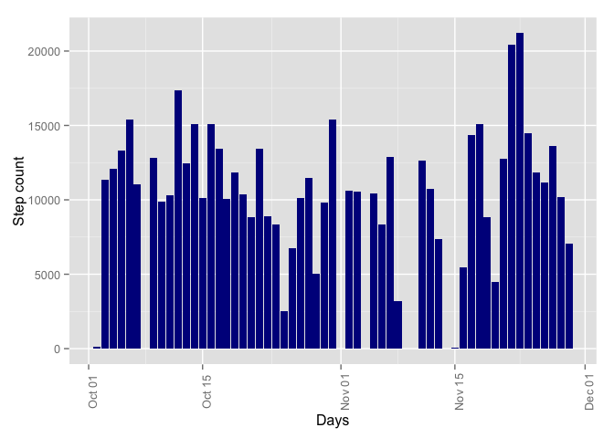
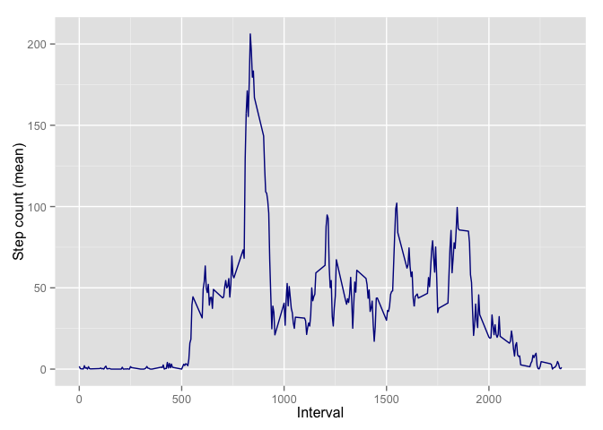
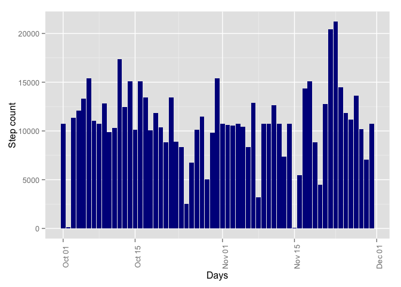
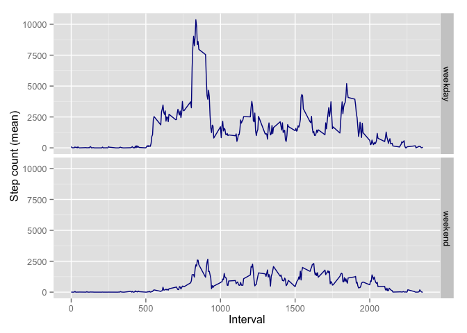

# Reproducible Research: Peer Assessment 1


## Loading and preprocessing the data

Unzip activity.csv if not present and load it. Convert date variable into proper format


```r
library("plyr")
library("dplyr")
```

```
## 
## Attaching package: 'dplyr'
## 
## The following objects are masked from 'package:plyr':
## 
##     arrange, count, desc, failwith, id, mutate, rename, summarise,
##     summarize
## 
## The following object is masked from 'package:stats':
## 
##     filter
## 
## The following objects are masked from 'package:base':
## 
##     intersect, setdiff, setequal, union
```

```r
library("lubridate")
```

```
## 
## Attaching package: 'lubridate'
## 
## The following object is masked from 'package:plyr':
## 
##     here
```

```r
library("ggplot2")

if (!file.exists("activity.csv")) {
    unzip("activity.zip")
}

data <- tbl_df(read.csv("activity.csv"))
data$real_date <- ymd(data$date)
```
## What is mean total number of steps taken per day?


```r
agg <- summarise(group_by(data, real_date), step_count = sum(steps))

ggplot(agg, aes(x=real_date, y=step_count)) + 
    geom_bar(stat="identity", fill = 'darkblue') + 
    theme(axis.text.x=element_text(angle=90)) + 
    xlab("Days") + 
    ylab("Step count")
```

```
## Warning: Removed 8 rows containing missing values (position_stack).
```

 

```r
#mean and mediancount of steps per day
mean(agg$step_count, na.rm=TRUE) 
```

```
## [1] 10766.19
```

```r
median(agg$step_count, na.rm=TRUE) 
```

```
## [1] 10765
```

## What is the average daily activity pattern?


```r
agg2 <- summarise(group_by(data, interval), mean_step_count = mean(steps, na.rm=TRUE))

ggplot(agg2, aes(x=interval, y=mean_step_count)) + 
     geom_line(color="darkblue") + 
     xlab("Interval") + 
     ylab("Step count (mean)")
```

 

```r
#5 minute interval with maximum steps, averaged across all days
agg2$interval[which.max(agg2$mean_step_count)]
```

```
## [1] 835
```


## Imputing missing values

There are NA's only in staps variable as you can see in summary below. I choose 
to impute values based on interval mean value.

As you can see below the mean value has not been affected, however median value
become equal to the mean.


```r
# Summary of data - number of NA should be visible for each variable
summary(data)
```

```
##      steps                date          interval        real_date         
##  Min.   :  0.00   2012-10-01:  288   Min.   :   0.0   Min.   :2012-10-01  
##  1st Qu.:  0.00   2012-10-02:  288   1st Qu.: 588.8   1st Qu.:2012-10-16  
##  Median :  0.00   2012-10-03:  288   Median :1177.5   Median :2012-10-31  
##  Mean   : 37.38   2012-10-04:  288   Mean   :1177.5   Mean   :2012-10-31  
##  3rd Qu.: 12.00   2012-10-05:  288   3rd Qu.:1766.2   3rd Qu.:2012-11-15  
##  Max.   :806.00   2012-10-06:  288   Max.   :2355.0   Max.   :2012-11-30  
##  NA's   :2304     (Other)   :15840
```

```r
# let's replace NA with mean value for the specific interval
new_data <-
    data %>%
    left_join(agg2, by=c("interval" = "interval")) %>% #join with aggregate
    mutate(steps = ifelse(is.na(steps), mean_step_count, steps)) %>% #update steps if needed
    select(1:4) # get rid of last row with aggregates

# No more NA'S
summary(new_data)
```

```
##     interval          steps                date         real_date         
##  Min.   :   0.0   Min.   :  0.00   2012-10-01:  288   Min.   :2012-10-01  
##  1st Qu.: 588.8   1st Qu.:  0.00   2012-10-02:  288   1st Qu.:2012-10-16  
##  Median :1177.5   Median :  0.00   2012-10-03:  288   Median :2012-10-31  
##  Mean   :1177.5   Mean   : 37.38   2012-10-04:  288   Mean   :2012-10-31  
##  3rd Qu.:1766.2   3rd Qu.: 27.00   2012-10-05:  288   3rd Qu.:2012-11-15  
##  Max.   :2355.0   Max.   :806.00   2012-10-06:  288   Max.   :2012-11-30  
##                                    (Other)   :15840
```

```r
# recalculate aggregates and draw histograms
agg3 <- summarise(group_by(new_data, real_date), step_count = sum(steps))

ggplot(agg3, aes(x=real_date, y=step_count)) + 
    geom_bar(stat="identity", fill = 'darkblue') + 
    theme(axis.text.x=element_text(angle=90)) + 
    xlab("Days") + 
    ylab("Step count")
```

 

```r
#mean and mediancount of steps per day
mean(agg3$step_count, na.rm=TRUE) 
```

```
## [1] 10766.19
```

```r
median(agg3$step_count, na.rm=TRUE) 
```

```
## [1] 10766.19
```
## Are there differences in activity patterns between weekdays and weekends?


```r
#add new factor to teh dataset
new_data <- mutate(new_data, weekday = as.factor(mapvalues(wday(real_date), from = 1:7, to=c("weekend", "weekday", "weekday", "weekday", "weekday", "weekday", "weekend") )))

summary(new_data)
```

```
##     interval          steps                date         real_date         
##  Min.   :   0.0   Min.   :  0.00   2012-10-01:  288   Min.   :2012-10-01  
##  1st Qu.: 588.8   1st Qu.:  0.00   2012-10-02:  288   1st Qu.:2012-10-16  
##  Median :1177.5   Median :  0.00   2012-10-03:  288   Median :2012-10-31  
##  Mean   :1177.5   Mean   : 37.38   2012-10-04:  288   Mean   :2012-10-31  
##  3rd Qu.:1766.2   3rd Qu.: 27.00   2012-10-05:  288   3rd Qu.:2012-11-15  
##  Max.   :2355.0   Max.   :806.00   2012-10-06:  288   Max.   :2012-11-30  
##                                    (Other)   :15840                       
##     weekday     
##  weekday:12960  
##  weekend: 4608  
##                 
##                 
##                 
##                 
## 
```

```r
#this time I will aggregate on the fly
ggplot(new_data, aes(x=interval, y=steps)) + 
    stat_summary(fun.y="sum", geom="line", color="darkblue") +
     xlab("Interval") + 
     ylab("Step count (mean)") +
     facet_grid(weekday ~ .)
```

 
